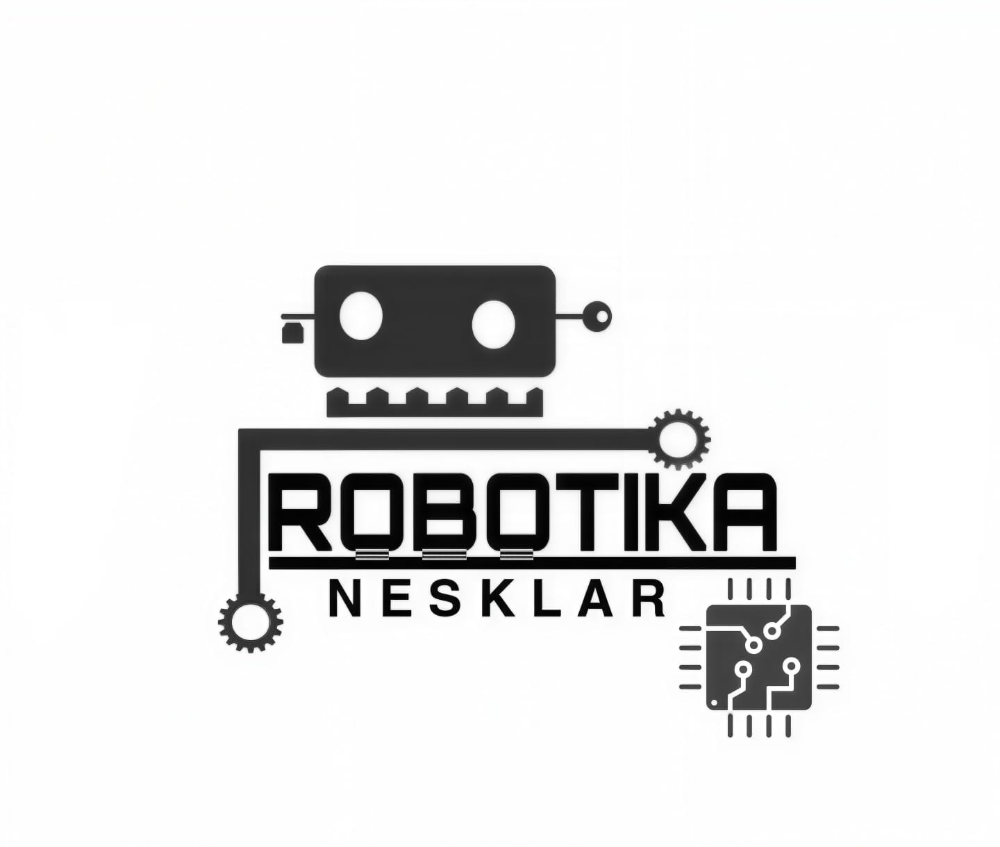

# 🤖 ArduiBlok — Microcontroller Visual & Text Studio

<p align="center">
  
  <br>
  <b>Studio Pemrograman Visual Blok & Teks C++ Modern untuk Mikrokontroler Arduino & ESP8266 dengan Cloud Compiler dan In-Browser Web Serial Flasher 1-Klik.</b>
</p>

<p align="center">
  <a href="https://railway.com/new/template?template=https://github.com/teukuazharpsh/ArduiBlok">
    
  </a>
</p>

<p align="center">
  
  
  
  
  
  
  
</p>

---

## ⚡ 1-Click Deploy ke Railway

Deploy aplikasi ArduiBlok Anda ke cloud **Railway** hanya dengan satu klik:

[](https://railway.com/new/template?template=https://github.com/teukuazharpsh/ArduiBlok)

> **Tips Pasca-Deploy:** Setelah proses build selesai di dashboard Railway, buka tab **Settings** ➔ klik **"Generate Domain"** pada bagian *Networking* untuk mengaktifkan URL publik ber-HTTPS gratis.

---

## 🌟 Fitur Unggulan ArduiBlok

### 1. ⚡ Upload Firmware Langsung 1-Klik di Browser (Web Serial Flasher)
Tidak perlu menginstal Arduino IDE, avrdude, maupun Python PyFlasher di komputer pengguna:
- **Arduino AVR (Uno, Nano, Mega, Pro Mini, Leonardo)**: Diprogram langsung melalui protokol **STK500 v1** menggunakan Web Serial API.
- **ESP8266 (NodeMCU / WeMos D1 Mini)**: Diprogram langsung melalui **ESP ROM Bootloader Protocol** (`esptool-js`) pada baud rate 115200 bps dengan auto-reset hardware via sinyal RTS/DTR.
- **Bilah Progres Real-Time**: Tampilan animasi persentase (0% ➔ 100%), status koneksi, ukuran berkas biner, dan reset board otomatis.
- **Tombol Cepat Serial Monitor**: Setelah upload berhasil, pengguna dapat langsung membuka Serial Monitor tanpa mencabut/memasang ulang kabel USB.

### 2. 📶 Dukungan Penuh Board ESP8266 & Blok IoT WiFi
- **Pilihan Board ESP8266**: NodeMCU 1.0 (ESP-12E), LOLIN/Wemos D1 Mini, dan ESP8266 Generic.
- **Kategori Khusus WiFi & IoT**:
  - `WiFi Connect (STA)`: Menghubungkan ke router WiFi dengan SSID & Password.
  - `WiFi Hotspot (AP)`: Membuat Access Point hotspot mandiri dari board.
  - `Cek Status Koneksi`: Mengembalikan status terhubung/terputus.
  - `IP Address & Kekuatan Sinyal`: Membaca IP lokal, IP Access Point, dan sinyal RSSI (dBm).
  - `HTTP Client GET / POST`: Berkomunikasi dengan REST API web server.
  - `ESP Restart`: Reboot mikrokontroler via software.
- **Dynamic Toolbox Filtering**: Blok WiFi & ESP otomatis muncul saat board ESP8266 dipilih dan disembunyikan saat board Arduino AVR aktif.

### 3. 🎯 Dukungan Lengkap Keluarga Board Arduino AVR
- **Arduino Uno** (`arduino:avr:uno`) — ATmega328P, Optiboot (115200 bps).
- **Arduino Nano (Old Bootloader)** (`arduino:avr:nano:cpu=atmega328old`) — Cocok untuk modul klon CH340 umum (57600 bps).
- **Arduino Nano (New Bootloader)** (`arduino:avr:nano:cpu=atmega328`) — Versi rilis baru (115200 bps).
- **Arduino Nano (ATmega168)** (`arduino:avr:nano:cpu=atmega168`) — Varian chip 168 (19200 bps).
- **Arduino Mega 2560** (`arduino:avr:mega:cpu=atmega2560`) — ATmega2560 (115200 bps).
- **Arduino Pro / Pro Mini** (`arduino:avr:pro`) — 5V 16MHz & 3.3V 8MHz (57600 bps).
- **Arduino Leonardo** (`arduino:avr:leonardo`) — ATmega32U4 (57600 bps).

### 4. 📊 Serial Monitor & Serial Plotter Multi-Channel Terintegrasi
- **Serial Monitor**: Kirim dan terima data UART real-time dengan pilihan baud rate lengkap (300 hingga 115200 bps), auto-scroll, timestamp, dan pembersih layar.
- **Serial Plotter**: Visualisasi grafik data sensor dinamis multi-channel otomatis dari nilai output serial (`Serial.println(nilai)`).

### 5. 📦 Pengelola Library Eksternal (Library Manager)
- **Katalog Online Resmi**: Cari dan pasang ratusan library mikrokontroler resmi langsung dari registry (LiquidCrystal, NeoPixel, DHT, Servo, Adafruit SSD1306 OLED, MFRC522 RFID, ArduinoJson, dll).
- **Add .ZIP Library**: Pasang berkas library kustom berformat `.ZIP` langsung dari browser ke server compiler.

### 6. 📝 Mode Ganda: Visual Blocks & Ace C++ Text Studio
- **Mode Visual Blok**: Berbasis Google Blockly klasik (*Geras renderer*) yang intuitif, ramah pemula, dan bebas syntax error.
- **Pencarian Blok Cepat**: Text box pencarian instan pada toolbox untuk menemukan blok sensor/aktuator dalam hitungan detik.
- **Mode C++ Text Editor**: Menggunakan *Ace Editor* berfitur lengkap (syntax highlighting, auto-completion, line numbers, dan tema engineering IDE).
- **Live Preview C++**: Tampilan kode Arduino C++ (`.ino`) yang digenerate secara langsung di panel samping.

### 7. 💾 Manajemen Proyek & Contoh Proyek Bawaan
- Format berkas proyek bawaan **`.tazp`** (XML Workspace + metadata konfigurasi board).
- Galeri proyek siap pakai (Blink LED, Running LED, Servo Control, Sensor Ultrasonik HC-SR04, IoT WiFi, dll) lengkap dengan skema wiring pin.
- Tombol unduh file output biner (**`.hex`** untuk AVR, **`.bin`** untuk ESP8266) dan kode sumber (**`.ino`**).

### 8. 📱 Dukungan USB OTG Android & Desain Responsif
- Kompatibel dengan browser Chrome/Edge di desktop serta perangkat Android melalui kabel USB OTG (termasuk polyfill WebUSB untuk WebView/Kodular).
- Layout antarmuka responsif dengan mode tema Terang (Light) dan Gelap (Dark).

---

## 💻 Menjalankan Secara Lokal (Local Development)

### Prasyarat:
1. [Node.js](https://nodejs.org/) versi 18 atau lebih baru.
2. [arduino-cli](https://arduino.github.io/arduino-cli/latest/installation/) terpasang dan ada di PATH sistem.
3. Install platform core yang dibutuhkan:
   ```bash
   # Install Core Arduino AVR
   arduino-cli core install arduino:avr

   # Install Core ESP8266
   arduino-cli config add board_manager.additional_urls https://arduino.esp8266.com/stable/package_esp8266com_index.json
   arduino-cli core update-index
   arduino-cli core install esp8266:esp8266

   # Install Library Standar
   arduino-cli lib install Servo
   ```

### Langkah Instalasi:
```bash
# 1. Clone repository
git clone https://github.com/teukuazharpsh/ArduiBlok.git
cd ArduiBlok

# 2. Install dependencies Node.js
npm install

# 3. Jalankan server lokal
npm start
# atau
node server/app.js
```
Buka browser dan akses: `http://localhost:3000`

---

## 🐳 Deployment Menggunakan Docker

Repositori ini sudah dilengkapi dengan `Dockerfile` teroptimasi berbasis Ubuntu Jammy yang menginstal `arduino-cli`, platform `arduino:avr`, platform `esp8266:esp8266`, Python3 toolchain, serta pustaka bawaan:

```bash
# Build Docker Image
docker build -t arduiblok .

# Jalankan Container
docker run -d -p 3000:3000 --name arduiblok-app arduiblok
```

---

## 📁 Struktur Direktori

```text
ArduiBlok/
├── Dockerfile                  # Konfigurasi container Linux + arduino-cli (AVR & ESP8266)
├── .dockerignore               # Filter berkas untuk build Docker
├── .gitignore                  # Filter berkas Git
├── package.json                # Dependensi Express.js & skrip server
├── README.md                   # Dokumentasi resmi proyek ArduiBlok
├── server/
│   └── app.js                  # Backend API: /compile, /health, library manager, status core
├── public/                     # Frontend Web Studio
│   ├── index.html              # Layout utama studio, toolbox, dialog, terminal
│   ├── style.css               # Styling UI modern, tema dark/light, responsif
│   ├── logo.jpeg               # Logo resmi Robotika Nesklar
│   ├── serial_flasher.js       # In-browser flasher: STK500 AVR & EspFlasher ESP8266
│   ├── esptool_bundle.js       # Bundel Web Serial ROM Bootloader ESP8266 (esptool-js)
│   ├── serial_monitor.js       # Antarmuka Serial Monitor UART Web Serial
│   ├── serial_plotter.js       # Visualisasi grafik data sensor real-time
│   ├── serial_polyfill.js      # Polyfill WebUSB Serial untuk perangkat mobile Android
│   ├── ch340_driver.js         # Driver & deteksi chip USB Serial CH340 / CP2102
│   ├── device_manager.js       # Smart Device Hub pemilihan port & koneksi mikrokontroler
│   ├── code_editor.js          # Integrasi Ace C++ text code editor
│   ├── library_manager.js      # Antarmuka pencarian & upload file .ZIP library
│   ├── examples_data.js        # Basis data contoh proyek siap pakai & wiring pin
│   ├── toolbox_search.js       # Algoritma pencarian real-time blok di toolbox
│   └── blocks/
│       ├── arduino_blocks.js   # Definisi blok visual Blockly (I/O, Motor, Sensor, WiFi)
│       └── arduino_generator.js# Generator kode C++ Arduino (.ino) dari susunan blok
└── temp/                       # Direktori kerja build terisolasi kompilasi sketch
```

---

## 🤝 Kontribusi & Dukungan

Proyek ini dikembangkan oleh **Teuku Azhar** bersama tim **Robotika Nesklar**. Jika Anda menemukan bug, memiliki saran fitur baru, atau ingin berkontribusi, silakan buat [Issue](https://github.com/teukuazharpsh/ArduiBlok/issues) atau ajukan [Pull Request](https://github.com/teukuazharpsh/ArduiBlok/pulls).

---

## 📄 Lisensi

Proyek ini dirilis di bawah lisensi **MIT License** — bebas digunakan, dipelajari, dan dikembangkan untuk kepentingan edukasi, riset, maupun implementasi robotika & IoT.
